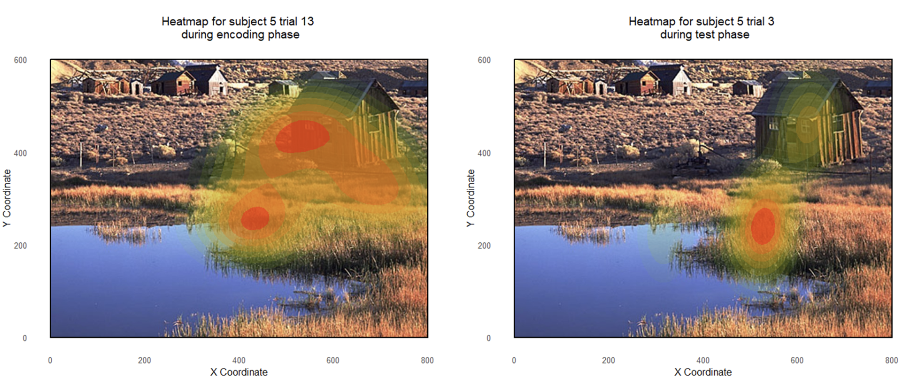

# **Introduction:**

The visual world is remarkably complex and often overwhelming in terms of the information it presents. Much of how we interact with our surroundings is based on visual information processing, which leads to distinct patterns of viewing behavior aimed at quickly and efficiently interpreting the environment. Due to the anatomical limitation of the retina, which restricts high-acuity vision to the fovea, we must constantly move our eyes to capture detailed visual information. These movements involve shifting foveal attention multiple times per second, where detailed data is acquired, punctuated by saccadic jumps between fixations. Research has consistently shown that eye movement can be influenced by both bottom-up processes (e.g., our natural tendency to focus on bright or moving stimuli) and top-down processes like how our current goals may guide our eye movements in a task like visual search (e.g. Yarbus, 1967; Castelhano et al., 2009; Loftus & Mackworth, 1978). The importance of these findings has led to an increased interest in using eye-tracking as a powerful tool in cognitive science research.

Eye movement data offer distinct advantages over brain imaging techniques and basic behavioral statistics. Eye-tracking is relatively easy to implement, more affordable than imaging methods, and provides valuable additional insights into cognitive processes such as memory (e.g., Hannula et al., 2010) and attention (e.g. Awh et al., 2012; van Zoest et al., 2004). In typical eye-tracking studies, participants sit in front of a display while their eye movements are recorded by a head-mounted or desk-mounted eye-tracker. The recorded eye movements are then mapped to the task the participant is performing, allowing for detailed analyses of time-sensitive viewing behavior and potential indices of underlying cognitive processes. Eye-tracking data (figure 1 & 2) typically consists of time-point samples which contain gaze coordinates (usually represented by x and y positions in a 2D space mapped onto the display), and are later used to compute measures of interest like fixation duration and saccadic amplitudes (the distance the eyes travel during a saccade, measured in pixels or visual degrees). However, there are different thresholds to determine what constitutes a fixation and what constitutes a saccade depending on the study and the phenomenon one is trying to study. Additionally, typical psychophysics experiments contain trial data organized into rows, with variables measured contained in the columns (see figure 3), and researchers often have a need to combine the two datasets which are organized differently. 

Figure 1. *Raw Eye-tracking Data Description 1*  
Figure 3. *Raw Eye-tracking Data Description 2* 

Figure 3. *Typical Psychophysics Experimental Data*  

Although several R packages, such as eyetrackingR and gazeR, have been designed to process eye movement datasets, many researchers still rely on custom code to perform data analysis and generate visualizations from their data. This can be challenging for researchers new to eye-tracking, as each visualization may take a long time to hand-craft and they may be unsure how to create visualizations that align with standards in the literature or effectively illustrate their findings.

This leads to the main objective of our project:

How should we visualize eye-tracking data? Given eye movements made throughout the time course of a trial, how do we display the data per image, per participant, per condition, per experiment? A key aspect of viewing behavior that has garnered significant attention is gaze or fixation patterns (e.g., Ramey et al., 2020; Wynn et al., 2019), which refer to sequences of fixations over a specified timeframe. First, the eye-tracking data is usually turned into a more usable format for researchers, which tends to be aggregated information about fixations and saccades that occurred within a trial.There are usually two types of data output. Proprietary file format .edf and Raw text file format .asc. After that, the most common way to visualize these patterns is through fixation heatmaps, where we would map out the density map of fixations in a given trial, where areas receiving a larger number of fixations (weighted by the duration of the aggregated fixations) should be distinctively colored compared to areas receiving no or fewer number of fixations. Some tools, like the gazeR package, even incorporate fixation duration into the heatmap’s color scheme. However, while heatmaps are useful for showing the overall distribution of fixations, they do not convey the **temporal sequence** of fixations clearly, and so information about the scanpaths is also lost. One of the major goals of this project is to address this limitation by developing a streamlined pipeline in R code that goes from from loading raw eye-tracking data to generating clear, comprehensive visualizations of eye movement behavior (such as graphs on fixation statistics, saccadic dispersion, or in the case of temporal analyses, a short video that shows the sequences of fixations and their accompanying scanpaths). 

# **Method:**

Eye movements were recorded with a SR-Research Eyelink 1000 Plus desktop mount eye-tracker sampling at 1000 Hz. Eye movement data was collected for either eye, or from both eyes. Saccades were pre- defined using the Eyelink 1000 Plus’s default velocity and acceleration thresholds (30°/s and 8000°/s2). Fixations were defined by Eyelink 1000 Plus’s default inter-saccade periods. In the code we develop, we would like to be able to change this variable and use the result in all subsequent analyses, in case other researchers have disagreements regarding what constitutes fixations and saccades (and microsaccades).

The experimental stimuli were colored turtles facing either left or right, presented on a beach background (Figure 4 & 5). Stimuli were placed onto the display in a rectangular grid with jitter added. The beach background contained a wave in the center, and contained a water light reflection pattern on either the left or right side.

For the purposes of evaluating the effectiveness of our heatmaps, we can compare two experimental conditions. There was a between-subjects manipulation of instruction (free-view, search) and subjects were randomly assigned to an instruction condition. Both instruction conditions received the same within-subject manipulations and the exact same generated search arrays. There were five set sizes for the less-salient purple turtles (0, 2, 4, 8, 16) and two salient turtle colors (yellow, green). The results showed drastic differences in first fixation statistics, as well as many eye-movement pattern measures, and we hope that these results will be reflected in the time-sequenced heatmaps we generate.

Figure 4. *Example of Display Stimuli Used in Study 1*  
Figure 5. *Example of Display Stimuli Used in Study 2* 

*Note.* *Top panel.* Example of trial used in study. The screen was blank for a variable time at the beginning of a trial. A fixation cross would blink until the participant fixated on it for 300ms. The trial display was gaze contingent and, in the free-view condition, it remained visible for two seconds, whereas in the search condition, it remained visible until response or four seconds had elapsed. Bottom panel. Stimuli used in study.

The eye-tracker was calibrated using a 3x3 spatial array before the experiment, and a single-point calibration (drift correct) occurred between every block of trials. We would like to include a check for calibration parameters and report subject average errors and group average errors.

Subjects in the free-view condition were given the following instructions: “In this experiment, we are interested in studying how people explore images with their eyes. We will show you several images and we just want you to look around. We will record your eye movements so that we can study how you are exploring the images.”

Subjects in the search condition were given the following instructions: “This experiment requires you to visually search for a target object and make a decision about it. The target you will be searching for is a red turtle. Your task is to decide towards which side the turtle’s head is facing, by pressing the LEFT or RIGHT ARROW key on the button box. And please try to respond as fast and as accurately as possible.” Before each trial was a solid color display that had the average color of the beach background, followed by a blinking fixation cross subjects had to fixate on in order to trigger the trial display. This meant that the first fixation made before the display appears is not informative, and should be excluded from analysis. Afterwards, the free-view display remained on screen for two seconds. The search display remained on screen for four seconds or until a response was made, whichever occurred earlier.

# **Variables:**

All the eye-tracking data are text files where a majority of the rows are a single time point containing information about the participants’ gaze at that time, regardless of what trial they were on (figure 1 & 2). Each row contains information of x position, y position and pupil size on a specific time. From this we will need to generate a list of fixations as well as saccades using any custom defined thresholds. Then given that list of eye movements made within a trial, we need to combine it to the main data file, where each row corresponds to an entire trial in its entirety. That is, we are grouping and collapsing the eye-tracking data into a more usable format for many kinds of research. From our main data file, we can overlay the fixation data onto screenshots of the stimuli to create heatmaps, since \~20 participants will have viewed the same image, so they will each contribute one sequence of fixations.


# **Plan of Analysis:**

From the data we collected from the data viewer, we will select the interested variables and conduct a classic table in which all the rows represent trials and columns represent variables, including fixations and saccades. We will compare how gaze behavior differs between the free-view and search conditions by looking at measures such as fixation duration, first fixation statistics, and saccadic movements from the table. By these analyses, we should be able to compare temporal gaze patterns with temporal sequence and scan path.

We will use these data to generate fixation heatmaps to help us better understand the density of fixation. This helps in visualizing where participants focused their gaze the most. We will use the GazeR package in R to help us differentiate the color by the duration of fixation. By overlaying heatmaps from different conditions, we might visually highlight differences in fixation density and focus areas between free-viewing and search tasks. 

The heat map function (figure 6) would generates a fixation density map to visualize the density distribution of fixations during one or multiple trials of an experiment using a real background image. The function begins by loading the background image based on the trial number and subsetting the data for a specific subject and trial. It then graphs the density map and processes the image by ensuring it has the specified resolution. The function calculates the fixation density, applies appropriate color coding, and allows for customization by adding a title and highlighting a specific target area if needed. Finally, the function outputs a graph that clearly illustrates the fixation density, providing an informative visualization of participants' attention patterns. The function takes in three parameters: the data file, subject number, and trial number.

Moreover, we will create the fixation order function (figure 7) which generates a visualization of the temporal sequence of fixations against a real image during an experiment. It begins by loading the background image based on the trial number and subsetting the data for a specific subject and trial, with each row representing one fixation. The function then graphs the fixation order, ensuring the image has the specified resolution and plotting each fixation with its corresponding ordinal number. Additional customization include adding a title to the graph and highlighting a specified target area if needed. The final output is a graph that clearly illustrates the sequence and order of fixations. The function requires three parameters: the data file, subject number, and trial number.Finally, we will make animation video based on the function.


Figure 6. *Heat map function*  
Figure 7. *Fixation order function* 

Prepare and clean files (here only looking at exp1 free view data)

```{r load_library, echo = FALSE}

library(tidyverse)
library(ggplot2)
library(gghalves)
library(rprojroot) 
library(here) 
library(MASS)
library(ggtern) #  Gaussian kernal calculation for heatmap
library(grid)
library(png)
library(ggimage) #package for image as background
library(eyelinker)
library(gganimate) # Animation
library(ggthemes) # ggplot2 theme for maps
library(av)
```

```{r setup_data}
### Path variables ----

here_path <- here::here()
docs_path <- here::here("doc")           # Using here
data_path <- file.path(here_path, "data")
raw_data_path <- file.path(data_path, "raw")
eyetracking_fv_data_path <- file.path(raw_data_path, "howard_dataset","eye_tracking", "freeview")
eyetracking_search_data_path <- file.path(raw_data_path, "howard_dataset","eye_tracking", "search")
processed_data_path <- file.path(data_path, "processed")
figures_path <- file.path(here_path, "results","figures")
heatmaps_path <- file.path(here_path, "results","heatmaps")
videos_path <- file.path(here_path, "results", "videos")
background_image_path <- file.path(raw_data_path, "howard_dataset", "screenshots", "exp1")

#read in raw file
data_fv <- read.csv(file.path(processed_data_path,"exp1_freeview.csv")) %>%
  dplyr::rename(trial = "original_TrialNum",
         p_trial = "TrialNumber",       
         subject = "participant",
         condition1_dnum = "num_distractors",
         condition2_sid = "singleton_id") %>%
  dplyr::select(trial,subject, condition1_dnum, condition2_sid, target_pos, singleton_pos, f1:f9, p_trial)

data_search <- read.csv(file.path(processed_data_path,"exp1_search.csv")) %>%
  dplyr::rename(trial = "original_TrialNum",
         p_trial = "TrialNumber",
         subject = "participant",
         condition1_dnum = "num_distractors",
         condition2_sid = "singleton_id") %>%
  dplyr::select(trial,subject, condition1_dnum, condition2_sid, target_pos, singleton_pos, f1:f8, p_trial)

# extract only the last four numbers in the raw fixation data
extract_last_four_numeric <- function(cell) {
  # Remove outer square brackets
  cell <- gsub("^\\[|\\]$", "", cell)
  
  # Split by commas
  parts <- str_split(cell, ",\\s*")[[1]]
  
  # Extract last four elements
  last_four <- tail(parts, 4)
  
  # Clean up residual quotes and convert to numeric
  last_four <- as.numeric(gsub("'", "", last_four))
  
  return(last_four)
}

# Apply cleaning to each column
cleaned_data_fv <- data_fv %>%
  mutate(across(everything(), ~ map(.x, extract_last_four_numeric))) %>% 
  group_by(trial,subject) %>%
  pivot_longer(values_to = "fix", names_to = "fix_num", f1:f9) %>%
  mutate(fix = gsub("^c\\(|\\)$", "", fix),
         target_pos = gsub("^c\\(|\\)$", "", target_pos),
         singleton_pos = gsub("^c\\(|\\)$", "", singleton_pos)) %>%
  filter(fix != "NA") %>%
  separate(fix, into = c("x", "y", "duration", "onset"), sep = ",\\s*", convert = TRUE) %>%
  separate(target_pos, into = c("target_x", "target_y"), sep = ",\\s*", convert = TRUE) %>%
  separate(singleton_pos, into = c("singleton_x", "singleton_y"), sep = ",\\s*", convert = TRUE) %>%
  mutate(subject = as.numeric(subject),
         trial = as.numeric(trial),
         p_trial = as.numeric(p_trial)) %>%
  mutate(y = 1080 - y,
         target_y = 1080 - target_y,
         singleton_y = 1080 - singleton_y)


cleaned_data_search <- data_search %>%
  mutate(across(everything(), ~ map(.x, extract_last_four_numeric))) %>% 
  group_by(trial,subject) %>%
  pivot_longer(values_to = "fix", names_to = "fix_num", f1:f8) %>%
  mutate(fix = gsub("^c\\(|\\)$", "", fix),
         target_pos = gsub("^c\\(|\\)$", "", target_pos),
         singleton_pos = gsub("^c\\(|\\)$", "", singleton_pos))%>%
  filter(fix != "NA") %>%
  separate(fix, into = c("x", "y", "duration", "onset"), sep = ",\\s*", convert = TRUE) %>%
  separate(target_pos, into = c("target_x", "target_y"), sep = ",\\s*", convert = TRUE) %>%
  separate(singleton_pos, into = c("singleton_x", "singleton_y"), sep = ",\\s*", convert = TRUE) %>%
  mutate(subject = as.numeric(subject),
         trial = as.numeric(trial),
         p_trial = as.numeric(p_trial)) %>%
  mutate(y = 1080 - y,
         target_y = 1080 - target_y,
         singleton_y = 1080 - singleton_y)

```

# **Results:**

Generate summary variables and plot of average saccade amplitude for the two data sourses.

```{r trial summaries}
calc_distance_function <- function(x1, y1, x2, y2) {
  sqrt((x2 - x1)^2 + (y2 - y1)^2)
}

# https://raw.githubusercontent.com/koundy/ggplot_theme_Publication/master/ggplot_theme_Publication-2.R

theme_Publication <- function(base_size = 14, base_family = "sans") {
  library(grid)
  library(ggthemes)
  (theme_foundation(base_size = base_size, base_family = base_family)
  + theme(
      plot.title = element_text(
        face = "bold",
        size = rel(1.2), hjust = 0.5, margin = margin(0, 0, 20, 0)
      ),
      text = element_text(),
      panel.background = element_rect(colour = NA),
      plot.background = element_rect(colour = NA),
      panel.border = element_rect(colour = NA),
      axis.title = element_text(face = "bold", size = rel(1)),
      axis.title.y = element_text(angle = 90, vjust = 2),
      axis.title.x = element_text(vjust = -0.2),
      axis.text = element_text(),
      axis.line.x = element_line(colour = "black"),
      axis.line.y = element_line(colour = "black"),
      axis.ticks = element_line(),
      panel.grid.major = element_line(colour = "#f0f0f0"),
      panel.grid.minor = element_blank(),
      legend.key = element_rect(colour = NA),
      legend.position = "bottom",
      legend.direction = "horizontal",
      legend.box = "vetical",
      legend.key.size = unit(0.5, "cm"),
      # legend.margin = unit(0, "cm"),
      legend.title = element_text(face = "italic"),
      plot.margin = unit(c(10, 5, 5, 5), "mm"),
      strip.background = element_rect(colour = "#f0f0f0", fill = "#f0f0f0"),
      strip.text = element_text(face = "bold")
    ))
}


generate_summaries_function <- function(data, subject = NULL, trial = NULL) {
  

  
  if (is.null(subject)) {
    subject <- unique(data$subject)
  }
  if (is.null(trial)) {
    trial <- unique(data$trial)
  }
 
  data <- data %>% 
    mutate(fix_num_value = as.numeric(gsub("f", "", fix_num)))
  

  
  sacc_amps <- data %>%
    arrange(trial, subject, fix_num_value) %>%
    group_by(trial, subject) %>%
    mutate(distance = calc_distance_function(x, y, lead(x), lead(y))) %>%
    summarise(total_distance = sum(distance, na.rm = TRUE)) 
  
  sacc_summaries_sub <- sacc_amps %>% 
    group_by(subject) %>%
    summarise(avg_sacc_amp = mean(total_distance)) 
  
  sacc_summaries_trial <- sacc_amps %>% 
    group_by(trial) %>%
    summarise(avg_sacc_amp = mean(total_distance)) 

  
  
  #TODO: these are currently just for all trials
  
  sacc_sub_graph <- ggplot(data = sacc_summaries_sub, aes(x=avg_sacc_amp))+
    geom_density() + theme_Publication() + ggtitle(paste("Average saccade amplitude for subject" , subject))+
  labs(x = "Saccade Amplitude")
  
  sacc_trial_graph <- ggplot(data = sacc_summaries_trial, aes(x=avg_sacc_amp))+
    geom_density() + theme_Publication() + ggtitle(paste("Average saccade amplitude during trial",trial))+
  labs(x = "Saccade Amplitude")

  print(sacc_sub_graph)
  print(sacc_trial_graph)
}

fv_graphs <- generate_summaries_function(cleaned_data_fv)
s_graphs <- generate_summaries_function(cleaned_data_search)


combined_graph <- ggplot() +
  geom_density(data = fv_graphs$data, aes(x = avg_sacc_amp, color = "freeview"), alpha = 0.5) +
  geom_density(data = s_graphs$data, aes(x = avg_sacc_amp, color = "search"), alpha = 0.5) +
  scale_color_manual(values = c("freeview" = "blue", "search" = "red"),
                     name = "Data Source") +
  labs(x = "Average Saccade Amplitude")+
  theme(panel.grid.major = element_blank(),
      panel.grid.minor = element_blank(),axis.text.y = element_blank()) + 
  ggtitle(paste("Average saccade amplitude during trial",fv_graphs$trial))
print(combined_graph)

```

Function for heat map and ordinal fixations.

```{r heatmap functions}

heatmap_function <- function(data, subject_num = NULL, trial_num = NULL) {
  
  if (is.null(subject_num)) {
    subject_num <- unique(data$subject)
  }
  if (is.null(trial_num)) {
    trial_num <- unique(data$trial)
  }
  
  pattern <- paste0("*_trialnum_", trial_num, ".png")
  
  image_files <- list.files(path = background_image_path, 
                           pattern = pattern,
                           recursive = TRUE,  # search in subdirectories
                           full.names = TRUE) # get full path
  
  # Take the first matching file (assuming there's only one per trial number)
  image_path <- image_files[1]
  image <- png::readPNG(image_path)
  
  # Filter data for the selected subject and trial
  heatmap_df <- data %>% 
    filter(subject %in% subject_num) %>% 
    filter(trial %in% trial_num)
  
  target_x = unique(heatmap_df$target_x)
  target_y = unique(heatmap_df$target_y)
    
  if (nrow(heatmap_df) == 0) {
    stop("No data available for this subject and trial.")
   }
  
  # plot the graph
  graph <- ggplot(heatmap_df, aes(x = x, y = y, fill = density)) +
    annotation_custom(
      rasterGrob(image, width = unit(1, "npc"), height = unit(1, "npc")), 
      xmin = 0, xmax = 1920, ymin = 0, ymax = 1080
    ) +
    theme_minimal() +
    stat_density2d(aes(x = x, y =y, fill = ..level.., alpha = ..level.., weight = duration), 
                   size= 1, bins= 10, geom='polygon') +
    scale_alpha(range = c(0, 0.8), guide = "none") +  # Set alpha scale; 0 for no density
    scale_fill_gradient(low = "#F0E442", high = "#56B4E9", guide = "none") +    
    labs(title = "Fixation Heatmap") +
    theme_minimal() +
    geom_rect(aes(xmin = 0, xmax = 1920, ymin = 0, ymax = 1080), fill = NA, color = "black", size = 1) +
    scale_x_continuous(breaks = seq(0, 1920, by = 480), limits = c(0, 1920)) + 
    scale_y_continuous(breaks = seq(0, 1080, by = 360), limits = c(0, 1080)) +   
    theme(panel.grid = element_blank(),  
          panel.border = element_blank(),
          plot.title = element_text(hjust = 0.5)) +
    ggtitle(paste("Heatmap for", "trial",trial_num,
                  "\n","# of distractors:",data$condition1_dnum,"and singleton condition",data$condition2_sid)) +
    geom_rect(data = heatmap_df, aes(xmin = target_x-20, xmax = target_x+20, ymin = target_y-20, ymax = target_y+20), fill = NA, alpha = 0.2, color = "black", size = 1) +
    annotate("text", x = target_x , y = target_y + 80, label = "target", size = 4, color = "black", fontface = "bold")+ 
    theme(axis.line=element_blank(),axis.text.x=element_blank(),
          axis.text.y=element_blank(),axis.ticks=element_blank(),
          axis.title.x=element_blank(),
          axis.title.y=element_blank(),legend.position="none",
          panel.background=element_blank(),panel.border=element_blank(),panel.grid.major=element_blank(),
          panel.grid.minor=element_blank(),plot.background=element_blank())
    
  
  return(graph)
}

# graph the fixations made for specifed trial ____________________________________________________________
fixation_order_function <- function(data, subject_num, trial_num) {
  
  # Construct the background image file path

  pattern <- paste0("*_trialnum_", trial_num, ".png")
  
  image_files <- list.files(path = background_image_path, 
                           pattern = pattern,
                           recursive = TRUE,  # search in subdirectories
                           full.names = TRUE) # get full path
  
  # Take the first matching file (assuming there's only one per trial number)
  image_path <- image_files[1]
  image <- png::readPNG(image_path)
  
  fixation_df <- data %>% 
    filter(trial == trial_num) %>%
    filter(subject == subject_num) %>%
    group_by(subject,trial) %>%
    mutate(order = row_number())
  
  target_x = unique(fixation_df$target_x)
  target_y = unique(fixation_df$target_y)
  
  if (nrow(fixation_df) == 0) {
    stop("No data available for this subject and trial.")
   }
  
  # plot the graph
  graph <- ggplot(fixation_df, aes(x = x, y = y)) +
    theme_minimal() +
    annotation_custom(rasterGrob(image, width = unit(1, "npc"), height = unit(1, "npc")), 
      xmin = 0, xmax = 1920, ymin = 0, ymax = 1080) +
    theme_minimal() +
    geom_path(arrow = arrow(type = "closed", length = unit(0.2, "cm")), color = "orange", size = 1) +
    geom_point(size = 8, shape = 21, fill = "red", color = "red", alpha = 0.5) +  # Circles for fixations
    geom_text(aes(label = order), color = "white", size = 4, fontface = "bold", vjust = 0.5) +  # Numbers inside circles
    labs(title = "Fixation Plot") +
    scale_x_continuous(breaks = seq(0, 1920, by = 480), limits = c(0, 1920)) + 
    scale_y_continuous(breaks = seq(0, 1080, by = 360), limits = c(0, 1080)) +   
    coord_fixed() +  # Keep the aspect ratio of the image
    theme_minimal() +
    theme(
      panel.grid = element_blank(),  
      panel.border = element_blank(),
      plot.title = element_text(hjust = 0.5)
    ) +
    ggtitle(paste("Fixation plot for","trial",trial_num,
                  "\n","# of distractors:",data$condition1_dnum[1],"and singleton condition",data$condition2_sid[1])) +
    geom_rect(aes(xmin = target_x-20, xmax = target_x+20, ymin = target_y-20, ymax = target_y+20), 
              fill = NA, alpha = 0.2, color = "black", size = 1) +
    annotate("text", x = target_x , y = target_y + 80, label = "target", size = 4, color = "black", fontface = "bold")+ 
    theme(axis.line=element_blank(),axis.text.x=element_blank(),
          axis.text.y=element_blank(),axis.ticks=element_blank(),
          axis.title.x=element_blank(),
          axis.title.y=element_blank(),legend.position="none",
          panel.background=element_blank(),panel.border=element_blank(),panel.grid.major=element_blank(),
          panel.grid.minor=element_blank(),plot.background=element_blank())
  
  return(graph)
}
```

Graph heatmap and fixations.

```{r graphs, warning=FALSE}
# if no input for subject_num, graph all subjects
heatmap_graph <- heatmap_function(cleaned_data_fv, 36, trial_num = 25)
fixation_graph <- fixation_order_function(cleaned_data_fv, 36, 24)

heatmap_graph
fixation_graph
```

Fixation order animation function

```{r video creation}
# read in data
et_data <- read.asc(file.path(eyetracking_fv_data_path, "EXP1_freeview_36_2023_05_02_10_55.asc"), parse_all = TRUE)
search_data <- read.asc(file.path(eyetracking_search_data_path, "EXP1_search_1_2023_03_29_16_02.asc"), parse_all = TRUE)

#subset messages and denote trial boundaries
msgs <- et_data$msg
msg2 <- search_data$msg

# first 12 pairs are practice trials, so block > 24
trial_bounds <- msgs %>% 
                  dplyr::filter((text == "stimuli_onset" | text == "freeview_timeup") & block > 24) 

search_trial_bounds <- msg2 %>% 
                  dplyr::filter((text == "stimuli_onset" | text %in% c("left_pressed", "right_pressed")) & block > 24) 

#assign trial_id to original raw data, and drop info outside of trials, 
#e.g. we do a gaze contingency check in the beginning of every trial 
make_trials <- function(eyetrack_data, bounds) {
  
  bounds <- bounds %>%
              group_by(block) %>%
              pivot_wider(names_from = text, values_from = time) %>%
              ungroup() %>%
              mutate(id = row_number()) %>%
              dplyr::select(id, stimuli_onset, freeview_timeup)
  

  trials <- eyetrack_data %>%
    mutate(trial_id = NA_integer_)
  
  for(i in 1:nrow(bounds)) {
    
    # Assign trial_id where time falls within window
    trials <- trials %>%
      mutate(
        trial_id = ifelse(
          time >= bounds$stimuli_onset[i] & 
          time <= bounds$freeview_timeup[i],
          bounds$id[i],
          trial_id
        )
      )
  }
  trials <- trials %>%
              drop_na(trial_id)
  
  return(trials)
  
}
search_make_trials <- function(eyetrack_data, bounds) {
  
  # First pivot wider and get response columns
  bounds <- bounds %>%
              group_by(block) %>%
              pivot_wider(names_from = text, values_from = time) %>%
              ungroup() %>%
              mutate(id = row_number()) %>%
              # Create a response_time column that takes either left or right press
              mutate(response_time = coalesce(left_pressed, right_pressed)) %>%
              dplyr::select(id, stimuli_onset, response_time)
  
  trials <- eyetrack_data %>%
    mutate(trial_id = NA_integer_)
  
  for(i in 1:nrow(bounds)) {
    
    # Use response_time instead of freeview_timeup
    trials <- trials %>%
      mutate(
        trial_id = ifelse(
          time >= bounds$stimuli_onset[i] & 
          time <= bounds$response_time[i],
          bounds$id[i],
          trial_id
        )
      )
  }
  trials <- trials %>%
              drop_na(trial_id)
  
  return(trials)
  
}

# make trial dataframe 
trials_df <- make_trials(et_data$raw, trial_bounds) %>%
              dplyr::select(time, xp, yp, trial_id) %>%
              mutate (yp = 1080-yp)
              
search_trials_df <- search_make_trials(search_data$raw, search_trial_bounds) %>%
              dplyr::select(time, xp, yp, trial_id) %>%
              mutate (yp = 1080-yp)


# now make a video for a particular trial ____________________________________________________________
video_plot_function <- function(data, subject_num = NULL, trial_num = NULL, et_data) {
  
  if (is.null(subject_num)) {
    subject_num <- unique(data$subject)
  }
  if (is.null(trial_num)) {
    trial_num <- unique(data$trial)
  }
  
  # Construct the background image file path

  pattern <- paste0("*_trialnum_", trial_num, ".png")
  
  image_files <- list.files(path = background_image_path, 
                           pattern = pattern,
                           recursive = TRUE,  # search in subdirectories
                           full.names = TRUE) # get full path
  
  # Take the first matching file (assuming there's only one per trial number)
  image_path <- image_files[1]
  image <- png::readPNG(image_path)
  
  heatmap_df <- data %>% 
    filter(subject %in% subject_num) %>% 
    filter(trial %in% trial_num)
  
  # do one trial, and sample time points every 5 rows
  et_data <- subset(et_data, trial_id == heatmap_df$p_trial[heatmap_df$trial == trial_num])%>%
                filter(row_number() %% 5 == 0) %>%
    group_by(trial_id) %>%
    mutate(time = time - time[1]) %>%
    mutate(time = as.numeric(time))
  
  target_x = unique(heatmap_df$target_x)
  target_y = unique(heatmap_df$target_y)
  
  # plot the graph
  graph <- ggplot() +
    scale_x_continuous(breaks = seq(0, 1920, by = 480), limits = c(0, 1920)) + 
    scale_y_continuous(breaks = seq(0, 1080, by = 360), limits = c(0, 1080)) +
    annotation_custom(
      rasterGrob(image, width = unit(1, "npc"), height = unit(1, "npc")), 
      xmin = 0, xmax = 1920, ymin = 0, ymax = 1080
    ) +
    geom_point(data = et_data, aes(x = xp, y = yp), size = 5, color = "firebrick2") +
    geom_path(data = et_data, aes(x = xp, y = yp, group = 1), color = "red", size = 0.6, alpha = 0.4) + # leave trace
    geom_text(data = et_data, aes(x = 960, y = 30, label = paste("Time:", time)),
            size = 4, color = "black", fontface = "bold", hjust = 0.5) +
    scale_alpha(range = c(0, 0.8), guide = "none") +
    scale_fill_gradient(low = "#F0E442", high = "#56B4E9", guide = "none") +    
    ggtitle(paste("Eye movement video for","trial",trial_num,"subject",subject_num)) +
    geom_rect(aes(xmin = 0, xmax = 1920, ymin = 0, ymax = 1080), 
              fill = NA, color = "black", size = 1) +
    geom_rect(data = heatmap_df,  
              aes(xmin = target_x-20, xmax = target_x+20, 
                  ymin = target_y-20, ymax = target_y+20), 
              fill = NA, alpha = 0.2, color = "black", size = 1) +
    annotate("text", x = target_x, y = target_y + 80, 
             label = "target", size = 4, color = "black", fontface = "bold") +
    theme_minimal() +  
    theme(axis.line = element_blank(),
          axis.text.x = element_blank(),
          axis.text.y = element_blank(),
          axis.ticks = element_blank(),
          axis.title.x = element_blank(),
          axis.title.y = element_blank(),
          legend.position = "none",
          panel.background = element_blank(),
          panel.border = element_blank(),
          panel.grid.major = element_blank(),
          panel.grid.minor = element_blank(),
          plot.background = element_blank(),
          panel.grid = element_blank(),
          plot.title = element_text(hjust = 0.5)
    ) +
    transition_reveal(along = time)
  
  # plot.margin = margin(t = 10, r = 10, b = 100, l = 10)
    video <- animate(graph, width = 6, height = 4, 
      units = "in", 
      res = 100,
      end_pause = 50
    )
  
  anim_save(filename = "animated.gif", path = videos_path)
  
  return(video)
}
```

```{r video_rendering, warning=FALSE}
video <- video_plot_function(cleaned_data_fv, 36, 25, trials_df)

video
```

```{r video_rendering 2}
video2 <- video_plot_function(cleaned_data_search, 1, 25, search_trials_df)
video2
```

Finally, we can use the two functions to compare the eye tracking data visually.

Figure 8. *Comparing heatmaps between study and test phase*  
Figure 9. *Comparing fixation order between study and test phase* 
